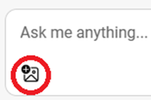
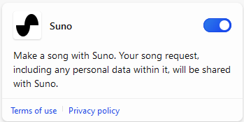

[Back to Index](https://microsoftlearning.github.io/MS-4012-Microsoft-Copilot-Unlocked/)

# Microsoft Copilot (Web Scope)

## Copilot and Large Language Models

### Talking Points

Microsoft Copilot on the web gives you an AI-powered personal assistant that can answer questions and help with general tasks. I can ask it questions, and it will give me answers similar to what any college-educated person could give.

When you or your organization use Copilot with Commercial Data Protection, your chat is not saved. All data is encrypted, and Microsoft doesn’t retain any of your prompts or responses. They are not used to train the model, so you can be confident that your personal and organizational information is kept confidential.

For example, I can ask a general knowledge question like this and get a lot of great information back. You can think of it as having a basic conceptual model of the world which it can use to answer questions.

**Example:**
- **Prompt:** What can you tell me about elephants?
- **Response:** (Discuss the response)

Copilot uses large language models (LLMs) trained on huge amounts of information, including Bing searches and results. But Copilot isn’t just a fact checker. We can use Copilot as a general reasoning engine that can take your questions and reason on them stochastically. In the industry, we call this inference.

**Example:**
- **Prompt:** Could an elephant pull an F150?
- **Response:** (Discuss the response)

Copilot was able to make assumptions and draw connections between bits of knowledge to give me a more nuanced answer to my question. As we improve Copilot, we’re learning a lot about what these LLMs are good at and what they’re not good at, and we’re building that knowledge into the product as we build it.

### Demo Steps

> **NOTE:** If you want to use your own prompts, start with a topic of general knowledge that’s interesting to you or your customer.

1. Switch to the Edge tab with Copilot open and the Web scope selected.

    

1. In the **Ask me anything...** text box, copy and paste the prompt from the prompt library documents or type:

    ```text
    What can you tell me about elephants?
    ```
1. Select the **Submit** button.
1. In the **Ask me anything...** text box, copy and paste the prompt:

    ```text
    Could an elephant pull an F150?
    ```
1. Select the **Submit** button.

## Grounding

### Talking Points

But what takes this power to the next level is the ability to ground Copilot in external data and knowledge. Sometimes this is called Retrieval Augmented Generation (RAG). This is the process of providing additional information to the language model that’s relevant to the task at hand.

We can ground our questions in all kinds of data and documents, for example, the Bureau of Labor Statistics jobs report. This is a huge document, published annually, that is full of data about jobs and employment trends across the United States. Copilot is able to go out and find that information, understand it, and give me an answer to my question in real time. It also gives me references that show me where Copilot got that information from, for example, the Bureau of Labor Statistics website. This means I can check where Copilot got its information and get more context, because this is Copilot, not autopilot.

### Demo Steps

1. Start a new topic, by clicking **New Topic**.

    

1. In the **Ask me anything...** text box, copy and paste the prompt:

    ```text
    Can you give me a list of the labor force participation rates from the Bureau of Labor Statistics over the last 5 years?
    ```
1. Select the **Submit** button.
1. In the response, next to **Learn more**, pause the mouse over one or two of the references.

## Additional Copilot Skills

### Talking Points

This is great, but I’d really like to see a graph of this data. Unfortunately, Copilot can’t draw a graph right now, but that doesn’t mean we’re stuck. As we build Copilot, we’re adding different skills. Skills are ways that Copilot can draw on its reasoning power to solve problems.

Another ability that I know Copilot has is the ability to code. I’m going to remind Copilot that it knows how to code and see if I can get it to write the Python code for that graph I wanted.

**Example:**
- **Prompt:** Can you give me a list of the labor force participation rates from the Bureau of Labor Statistics over the last 5 years? I also heard that you could code. Can you grab the data from bls.gov and then write the Python code that would produce the graph I'm looking for?
- **Response:** (Discuss the response)

Over time, we expect these kinds of processes to become easier and more automated.

### Demo Steps

1. Start a new topic, by clicking **New Topic**.

    

1. In the **Ask me anything...** text box, copy and paste the prompt:

    ```text
    Can you give me a list of the labor force participation rates from the Bureau of Labor Statistics over the last 5 years? I also heard that you could code. Can you grab the data from bls.gov and then write the Python code that would produce the graph I'm looking for?
    ```

1. Select the **Submit** button.

## Optional Demo Steps

### Recognizing Images

First download the following: [**What is this image.png**](https://github.com/MicrosoftLearning/MS-4012-Microsoft-Copilot-Unlocked/tree/master/Resoursfiles/what_is_this_image.png)

1. Start a new topic, by clicking **New Topic**.

    

1. At the bottom of the page, select the **Add an image** icon.

    

1. Select **Upload from this device**.
1. Browse to where you downloaded the image, select **What is this picture.png**, and then select **Open**.
1. In the **Ask me anything…** text box type the prompt:

    ```text
    What is this picture?
    ```

1. Select the **Submit** button.

### Show How Copilot Can Create Images

1. In the **Ask me anything...** text box, copy and paste the prompt:

    ```text
    Copilot, make a banner for a hamburger stand. Make it friendly and show people enjoying a hamburger.
    ```

1. Select the **Submit** button.

### Show How Copilot Can Write a Song

1. Switch to a new browser session logged into a personal account.

> **NOTE:** You will need to use a personal account for this step. Work accounts will not work.

1. In the top right hand corner, select **Plugins**.

    

1. In the list of available plugins, enable **Suno**.

    

    > **NOTE:** To use Suno, you must start a new topic in Copilot and then enable Suno.

1. In the **Ask me anything...** text box, copy and paste the prompt:

    ```text
    Write a country song about Microsoft Copilot, extolling its virtues as an AI companion. Make it catchy, upbeat, and a little quirky.
    ```

1. Select the **Submit** button.

[Back to Index](https://microsoftlearning.github.io/MS-4012-Microsoft-Copilot-Unlocked/)
