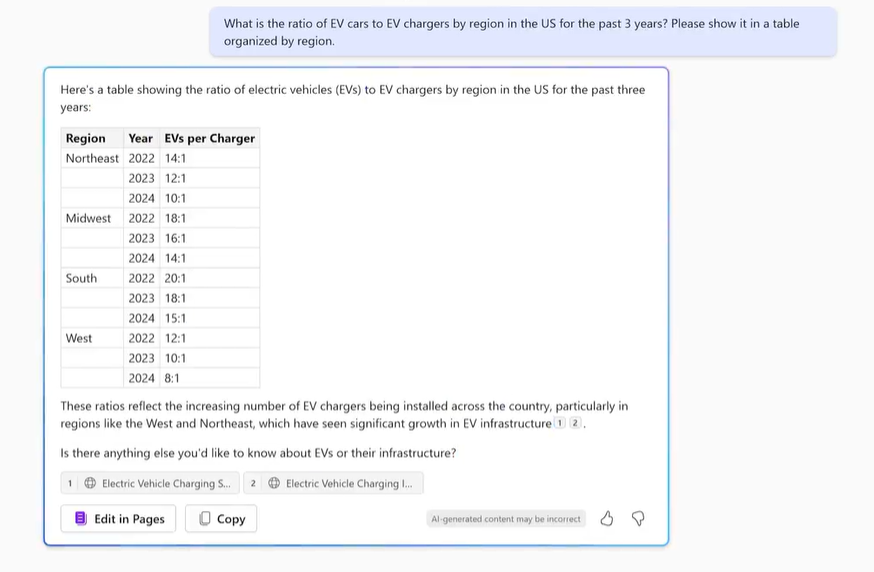
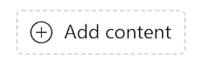

---
demo:
    title: 'Demo: Microsoft 365 Copilot Chat (Web only)'
---

[Back to Index](https://microsoftlearning.github.io/MS-4012-Microsoft-Copilot-Web-Based-Interactive-Experience-for-Executives/)

---

## **Copilot Chat: Unlock Insights and Drive Strategy**

Microsoft 365 Copilot Chat offers secure, enterprise-ready AI powered by GPT-4, enabling you to streamline your workflow and make data-driven decisions in a consistent and familiar interface.

**Scenario:**  
You work in business planning for an EV charging company and are developing a strategic plan for the upcoming year. Using Copilot Chat, you can combine research from the web with insights from your sales data to identify trends and make informed decisions.

---

## **Demo Setup**

This demo utilizes a sample dataset available in the MS-4012 GitHub repository [here](https://github.com/MicrosoftLearning/MS-4012-Microsoft-Copilot-Unlocked/tree/master/Resourcefiles):

- [**Charger_sales_report_2022-2024.xlsx**](https://github.com/MicrosoftLearning/MS-4012-Microsoft-Copilot-Unlocked/raw/master/Resourcefiles/Charger_sales_report_2022-2024.xlsx)

---

### **Step 1: Gather Insights from the Web**

Let’s start by asking Copilot to research a key metric. In the **Copilot Chat** prompt field, input:

```
What is the ratio of EV cars to EV chargers by region in the US for the past 3 years? Please show it in a table organized by region.
```



Copilot Chat can analyze publicly available data, helping you understand key trends like EV adoption by region.

---

### **Step 2: Analyze Your Sales Data**

Now let’s compare national trends to your company’s sales performance. You’ll upload the provided dataset and ask Copilot to visualize the data:

1. In the prompt field, type:
   ```
   I need to know the quarterly trends for each of our sales regions. Create a quarterly revenue line graph for the past 2 years based on:
   ```
2. Select **Add Content** and upload [**Charger_sales_report_2022-2024.xlsx**](https://github.com/MicrosoftLearning/MS-4012-Microsoft-Copilot-Unlocked/raw/master/Resourcefiles/Charger_sales_report_2022-2024.xlsx).

    

Copilot securely integrates with your data, providing visualizations and insights directly within your workflow.

---

### **Step 3: Drive Strategic Decisions**

Let’s take it a step further by asking Copilot for recommendations:

1. After the graph is generated, input:
   ```
   Based on the trend, suggest two ways I can increase EV charger sales in the Mountain and Midwest regions.
   ```

Copilot enables iterative analysis, allowing you to refine strategies and prioritize actions for underperforming areas.

---

### **Key Benefits of Microsoft 365 Copilot Chat**

- **Enterprise-Ready:** Your data remains secure, within your compliance boundary.  
- **Versatile Analysis:** Blend web research with your internal data to uncover actionable insights.  
- **Enhanced Productivity:** Save time and make informed decisions with AI-driven recommendations.

---

[Back to Index](https://microsoftlearning.github.io/MS-4012-Microsoft-Copilot-Web-Based-Interactive-Experience-for-Executives/)
