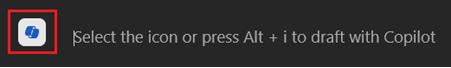
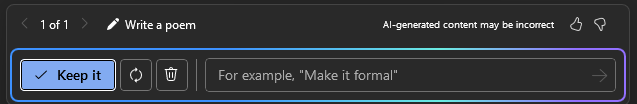
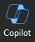

---
demo:
    title: 'Demo: Copilot for Microsoft Word'
---

# Copilot for Microsoft Word

### Environment Setup

The sample documents can be found in the MS-4012 GitHub repository under [**All Files > Demo Sample Docs**](https://github.com/MicrosoftLearning/MS-4012-Microsoft-Copilot-Unlocked/tree/master/Allfiles/Demo%20Sample%20Docs).

The specific files being used in this exercise are:

- [**ContosoLearn App Overview.docx**](https://github.com/MicrosoftLearning/MS-4012-Microsoft-Copilot-Unlocked/raw/master/Allfiles/Demo%20Sample%20Docs/ContosoLearn%20App%20Overview.docx)
- [**ContosoLearn Competitor SWOT.docx**](https://github.com/MicrosoftLearning/MS-4012-Microsoft-Copilot-Unlocked/raw/master/Allfiles/Demo%20Sample%20Docs/ContosoLearn%20Competitor%20SWOT.docx)
- [**ContosoLearn Value Proposition.docx**](https://github.com/MicrosoftLearning/MS-4012-Microsoft-Copilot-Unlocked/raw/master/Allfiles/Demo%20Sample%20Docs/ContosoLearn%20Value%20Proposition.docx)
- (Optional - see instructions below) [**Microsoft FY24 Second Quarter Earnings Conference Call**](https://github.com/MicrosoftLearning/MS-4012-Microsoft-Copilot-Unlocked/raw/master/Allfiles/Demo%20Sample%20Docs/Microsoft_FY24_Second_Quarter_Earnings_Conference_Call.docx) 

> [!NOTE]
> It can take up to 10 minutes for these files to sync to your OneDrive. To expedite this process, you can open the document and then close it, which will add it to your Most Recently Used (MRU) list.

### Talking Points

In the Interactive Experience, we brainstormed new app or service ideas, created brand identity and marketing assets, and analyzed the competitive landscape. But how can we take this a step further?

With Copilot in Word, we can transform the process of document creation and refinement, enabling you to produce compelling content with ease.

In this demo, we will take the documents we just created and transform them together to create a strategic analysis report. Additionally, we will adjust the format and tone to ensure the content aligns perfectly with our objectives.

### Demo Steps

1. Launch Microsoft Word either on the desktop or by typing **Word.new** in a new Edge tab.
1. Click into the body of the document and select the Copilot icon displayed.

    

1. In Word, the "Draft with Copilot" window should now be displayed. In the prompt field, enter the following prompt:

    ```
    Create a comprehensive strategic analysis report for ContosoLearn using the following files as references: /ContosoLearn App Overview, /ContosoLearn Competitor SWOT, and /ContosoLearn Value Proposition. The strategic analysis report should include the following sections:
        
    Executive Summary
    App Overview
    Market Research
    Competitor SWOT Analysis
    Value Proposition
    Strategic Insights
    Recommendations
    Conclusion
    ```

> [!IMPORTANT]
> You will need to re-type “/” and select the correct files from the Most Recently Used (MRU) list for this to function properly.
1. Copilot will now generate a draft of the strategic analysis report based on the prompt you provided. Once Copilot has finished, the following prompt window will be displayed:

    
    
    In the prompt field, enter the following:

    ```
    Remove the "Market Research" section and add a "Competitive Landscape" section. Ensure the content is concise and aligns with the overall tone of the document.
    ```
> [!NOTE]
> If Copilot for Word is not cooperating with you, you can use the following link to access the generated document: [**ContosoLearn Example Word Output**](https://github.com/MicrosoftLearning/MS-4012-Microsoft-Copilot-Unlocked/raw/master/Allfiles/Demo%20Sample%20Docs/ContosoLearn_Example_Word_Output.docx).

### Optional Demo Steps

1. Download and open the following file in Word on your desktop: [**Microsoft FY24 Second Quarter Earnings Conference Call**](https://github.com/MicrosoftLearning/MS-4012-Microsoft-Copilot-Unlocked/raw/master/Allfiles/Demo%20Sample%20Docs/Microsoft_FY24_Second_Quarter_Earnings_Conference_Call.docx).
1. Within Word, on the ribbon, select the Copilot icon.

    
1. In the "Ask me anything about this document" field, copy and paste the prompt or type: 

    ```
    Based on the document, how did AI impact Microsoft's earnings this year?
    ```

1. Select Send.  
1. In the "Ask me anything about this document" field, copy and paste the prompt or type: 

    ```
    Copilot, generate a FAQ based on this document.
    ```
1. Select Send.
