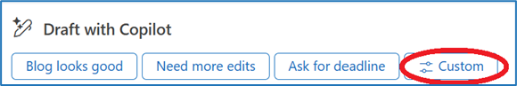
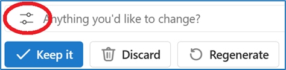

---
demo:
    title: 'Demo: Copilot in Outlook'
---

[Back to Index](https://microsoftlearning.github.io/MS-4012-Microsoft-Copilot-Unlocked/)

# Copilot in Outlook

## Demo Setup

The demo setup instructions for this option can be found [here](https://microsoft.seismic.com/Link/Content/DCFPQWmT2DMXC8WJjgjP4H44GWXG). Specifically, pages 1-4, which covers how to set up the email thread we will reference in the demo below.

> **IMPORTANT:**  The demo setup will require at least 4 people (optionally 6). Conduct this with your team before your planned delivery. Once completed, you can reference this email for future deliveries.

## Talking Points

"Let’s take a look at an email thread. This is a fictitious discussion where my team is talking about an important blog post about Copilot. It may look a lot like email threads you see every day.

When I select the Summary by Copilot button, Copilot summarizes the thread for me and gives me the most relevant points.

That’s pretty useful. I have long email threads arriving in my inbox all the time, and it can be a chore to disentangle what’s important and what’s not.

I’m going to reply, and I’ll use Copilot to help me. We can see that Copilot has generated some suggested prompts because Copilot has read the email thread and has an understanding of the context and how I might want to reply.

This is useful, but this reply requires a custom prompt. I can also edit this prompt to customize the tone and length of the reply.

When I select 'Sound like me,' Copilot looks at my outgoing email and makes sure that its response matches my personal communication style. Let’s use that.

This is pretty good, but I think it can be better. Copilot results are based, in part, on the quality of the question asked.

OK, I’m going to keep this response."

## Demo Steps

1. Switch to Outlook with the demo email thread open.

    > **IMPORTANT:**  Do not show any emails that contain confidential data.

1. Below the email’s subject, select **Summary by Copilot** and point out the results.
1. At the top of the page, select **Reply all**.
1. At the bottom of the new email field, point out the **Draft with Copilot** section and suggested prompts.
1. Select **Custom**.

    


1. In the **What do you want the email to say** field, copy and paste the prompt or type: 

    ```text
    Approve and thank the team--be warm! They worked hard. And be a little funny if you can.
    ```

1. Select the **Edit prompt** button.

    

1. Select **Sound like me**.
1. Select **Generate**.
1. Select the **Anything you’d like to change?** Text box.
1. Copy and paste the prompt or type: 

    ```text
    Can you make a that a bit longer? It's just a little bit too short.
    ```

1. Select the **Generate** button.  
1. **Optional**: In the **Anything you’d like to change?** Text box, type **"Make it funnier"** and then select Generate.
1. Select **Keep it**.

    > **NOTE:**  Do not send the reply, as you may wish to re-use this email thread for future demos.

[Back to Index](https://microsoftlearning.github.io/MS-4012-Microsoft-Copilot-Unlocked/)