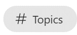
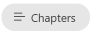
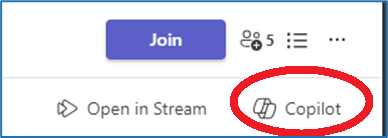

---
demo:
    title: 'Demo: Copilot in Teams'
---

[Back to Index](https://microsoftlearning.github.io/MS-4012-Microsoft-Copilot-Unlocked/)

# Copilot in Teams

## Demo Setup

The Demo Setup instructions can be found in the MS-4012 GitHub repository under [**All Files > Demo Setup**](https://github.com/MicrosoftLearning/MS-4012-Microsoft-Copilot-Unlocked/raw/master/Allfiles/Demo_Setup).

The specific file you'll need to reference is: [**Copilot_Demo_Guidance_Prep_Session.docx**](https://github.com/MicrosoftLearning/MS-4012-Microsoft-Copilot-Unlocked/raw/master/Allfiles/Demo_Setup/Copilot_Demo_Guidance_%20Prep%20Session.docx). Specifically, pages 5-10, which covers how to set up the teams meeting (Project Avalon) we will reference in the demo below.

> **IMPORTANT:**  The demo setup will require at least 4 people (optionally 6). Conduct this with your team before your planned delivery. Once completed, you can reference this teams meeting for future deliveries.

## Talking Points

"Now, I’m going to show you what we call a meeting recap in Teams.

Here’s a meeting between me and my colleagues. We can’t show you our real meeting for confidentiality reasons, but here is a fictitious meeting that I recorded with my team where we’re talking about the launch of a fictional product called Project Avalon.

The recap was based on the recording transcription. It shows who was involved and when they were talking. There’s also a summary of what we were talking about. Copilot has organized my meeting by sections to make it easier to find what I’m looking for.

Now I can ask Copilot questions and get more information about this meeting. For example, let’s see what was discussed and what the action items are for each person."

## Demo Steps

1. Switch to the browser tab with Microsoft Teams open to the meeting **Project Avalon launch meeting**.

    > **IMPORTANT:**  Do not show any meetings or chats that contain confidential data.

1. Select the **Recap** tab.

    

1. Point out the **Speakers**.
1. Select **Topics**.

    

1. Select **Chapters**.

    

1. In the upper right corner, select **Copilot**.

    

1. In the **Ask me anything about this meeting** text box, copy and paste the prompt:

    ```text
    Can you list action items and owners in a table?
    ```

1. Select **Send**.
1. In the **Ask me anything about this meeting** text box, copy and paste the prompt: 

    ```text
    Did anyone strongly oppose the decision, and how do you know?
    ```
    
1. Select **Send**.
1. In the **Ask me anything about this meeting** text box, copy and paste the prompt:

    ```text
    Based on the transcript, when would you recommend we launch the product and why?
    ```

1. Select **Send**.

[Back to Index](https://microsoftlearning.github.io/MS-4012-Microsoft-Copilot-Unlocked/)