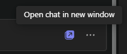
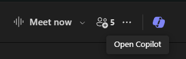
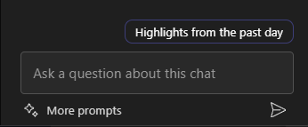
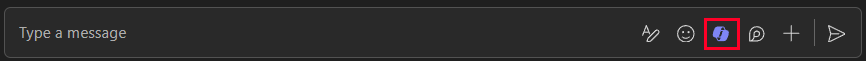

---
demo:
    title: 'Demo: Copilot in Teams'
---

[Back to Index](https://microsoftlearning.github.io/MS-4012-Microsoft-Copilot-Web-Based-Interactive-Experience-for-Executives/)

# Copilot in Teams

## Demo Setup

To ensure a smooth demo, choose one of the following setup options:

**Option A: Meeting Recap**

The demo setup instructions for this option can be found [here](https://microsoft.seismic.com/Link/Content/DCFPQWmT2DMXC8WJjgjP4H44GWXG). Specifically, refer to pages 5-10, which cover how to set up the Teams meeting (Project Avalon) we will reference in the demo below.

> **IMPORTANT:**
> - The Option A demo setup will require at least 4 people (optionally 6).
> - Conduct this with your team before your planned delivery.
> - Once completed, you can reference this Teams meeting for future deliveries.
> - If you are unable to do the prep work for any reason, reference the Option B demo.

**Option B: Teams Chat**

This demo option intentionally has no pre-setup required. However, you will need to leverage one of your own pre-existing Teams Chat threads. Ensure that there is no confidential information shared in this chat prior to using it for your demo.


## Option A - Meeting Recap Demo

### Talking Points

"Now, I’m going to show you what we call a meeting recap in Teams.

Here’s a meeting between me and my colleagues. We can’t show you our real meeting for confidentiality reasons, but here is a fictitious meeting that I recorded with my team where we’re talking about the launch of a fictional product called Project Avalon.

The recap was based on the recording transcription. It shows who was involved and when they were talking. There’s also a summary of what we were talking about. Copilot has organized my meeting by sections to make it easier to find what I’m looking for.

Now I can ask Copilot questions and get more information about this meeting. For example, let’s see what was discussed and what the action items are for each person."

### Demo steps

1. Switch to the browser tab with Microsoft Teams open to the meeting **Project Avalon launch meeting**.

    > **IMPORTANT:**  Do not show any meetings or chats that contain confidential data.

1. Select the **Recap** tab.

    

1. Point out the **Speakers**.
1. Select **Topics**.

    

1. Select **Chapters**.

    

1. In the upper right corner, select **Copilot**.

    

1. In the **Ask me anything about this meeting** text box, copy and paste the prompt:

    ```text
    Can you list action items and owners in a table?
    ```

1. Select **Send**.
1. In the **Ask me anything about this meeting** text box, copy and paste the prompt: 

    ```text
    Did anyone strongly oppose the decision, and how do you know?
    ```
    
1. Select **Send**.
1. In the **Ask me anything about this meeting** text box, copy and paste the prompt:

    ```text
    Based on the transcript, when would you recommend we launch the product and why?
    ```

1. Select **Send**.

## Option B - Teams Chat

### Talking Points

"Now, I’m going to show you how Copilot can enhance our Teams Chat experience.

Here’s a chat thread between me and my colleagues. Copilot helps by summarizing the highlights from our chat, making it easier to catch up on important points without having to read through every message.

Now I can ask Copilot questions to get more specific information from the chat. For example, let’s find out what the open items are and how we should proceed with the next steps.

Additionally, I can draft a reply and use Copilot to refine it, ensuring that my message is clear and concise. This is particularly useful for ensuring effective communication within the team."

### Demo steps

1. Find a Teams Chat thread where you have not shared any confidential information. Select the option **Open chat in a new window**.

    

1. With the Teams Chat opened in a new window, select **Open Copilot** in the top right hand corner.

    

1. In the Copilot chat pane that opens, select **Highlights from the past day*** for a quick summary of chats from the past  day.

    

1. In the **Ask a question about this chat** text box, copy and paste the prompt: 

    ```text
    What are the open items?
    ```
    > **Note:**  Feel free to choose an alternative prompt example that you believe will target your audience better.   

1. Under the chat history, in the **Type a message** text box, start typing a reply. **Do not hit send yet.**

1. With your reply draft, select Copilot from the **Type a message** text box.

       

1. Experiment with the **Rewrite** and **Adjust** copilot options to further demostrat Copilots capabilities.

         

[Back to Index](https://microsoftlearning.github.io/MS-4012-Microsoft-Copilot-Web-Based-Interactive-Experience-for-Executives/)
